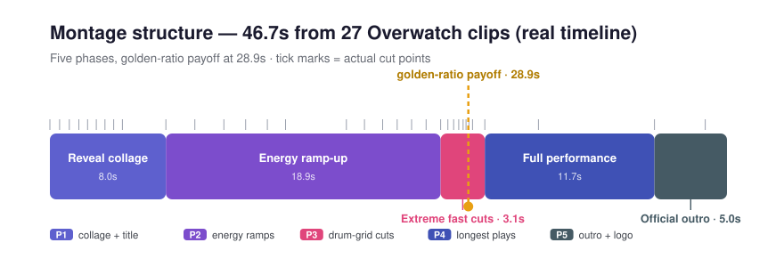
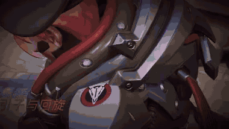

# game-highlight-montage

[](./LICENSE)


**English** | [简体中文](./README.zh-CN.md)

Turn a batch of raw gameplay highlight clips into a rhythm-driven montage video — using a professional editing methodology, data-driven segment selection, and a fully code-driven render pipeline. The whole process is executed end-to-end by your AI agent: **you hand it clips, it hands you a finished video.**

> Designed for AI Agents that follow the `SKILL.md` convention (WorkBuddy, Claude Code, and similar).

## Demo

**Montage structure** — the real timeline behind the demo below (27 Overwatch "Play of the Game" clips → 46.7s). Tick marks are actual cut points; the golden-ratio payoff lands at 28.9s:



**Output preview** (reveal collage → extreme fast cuts → golden-ratio payoff):



## Why not just ask the agent to "cut these clips together"

Generic prompts produce generic montages: evenly spaced kills, music that ignores the pacing, effects that change every run. This skill encodes three things most attempts miss:

1. **A proven editing methodology** — reveal collage → energy ramp-up → extreme fast cuts on the drum grid → full-performance bookends → official outro, with the hardest hit placed exactly at the golden-ratio point (total × 0.618)
2. **Data before eyeballs** — frame-difference energy locates the action-dense windows, sharpness detection filters out low-quality footage, and every candidate is still verified frame-by-frame before it makes the cut
3. **Reproducibility** — every effect (zoom punch, cut-frame flash, tilted slice collage, cinematic letterbox) is code. Iterate on the timeline, re-render, get the same result deterministically

## What It Does

- **Per-game profiles** — separate rhythm profiles for FPS (Overwatch / Valorant / CS:GO / Delta Force) and MOBA (Honor of Kings / League of Legends)
- **Platform-length presets** — Weibo 35s / Douyin 45s / Bilibili 90s / vertical 60s recipes with a hard golden-ratio constraint
- **BGM energy alignment** — picks the music window so the video's golden-ratio point lands on the BGM's high-energy plateau
- **One-command BGM generation** — `bgm_generate.py` calls a hosted ACE-Step endpoint, generates N candidates, slides a window across each track and auto-scores alignment, then exports a ready-to-use `bgm_best.mp3` (~$0.12 for a 45s video, 5 candidates)
- **BGM construction brief & alignment check** — `bgm_brief.py` writes a precise musical brief for ACE/human composers; `bgm_onset.py` checks whether generated music's drum hits land on the video cuts
- **BGM style guide** — measured evidence that heavy drums + distorted guitar solo beat pure synth-electronic for FPS montages, with acceptance criteria
- **Fully code-driven effects** — zoom punch, purple frame-flash, tilted slice collage, cinematic letterbox + slow push… all reproducible and editable

## Repository Layout

```
game-highlight-montage/
├── SKILL.md                       # Skill entry (triggers, three rules, 7-step workflow)
├── scripts/
│   ├── motion_energy.py           # Frame-difference energy analysis, ranks high-energy windows
│   ├── sharpness_check.py         # Sharpness check, flags low-quality clips
│   ├── bgm_energy.py              # Per-second BGM energy curve, helps pick the music window
│   ├── bgm_brief.py               # BGM construction-brief generator for composers / ACE
│   ├── bgm_onset.py               # Drum-hit detection + alignment check against video cuts
│   ├── bgm_generate.py            # One-command cloud ACE-Step generation: candidates + sliding-window auto-select
│   ├── bgm_section_check.py       # Per-section audio/video structure check (energy, drum density, cut/drum ratio)
│   └── make_impacts.py            # Synthesize hit/impact sounds for surgical reinforcement without regenerating music
└── references/
    ├── methodology.md             # The complete editing methodology (distilled from real projects)
    ├── game-profiles.md           # Per-game highlight characteristics and structure adjustments
    ├── platform-presets.md        # Platform length presets and parameterized formulas
    ├── bgm-style.md               # BGM style guide: heavy drums + guitar solo, measured data & acceptance criteria
    └── ace-step.md                # ACE/ACE-Step integration reference: four cloud/local routes and cost comparison
```

## Requirements

| Dependency | Purpose | How to get it |
|---|---|---|
| ffmpeg / ffprobe | Media inspection, pre-cutting, frame extraction | Windows portable build: `https://registry.npmmirror.com/-/binary/ffmpeg-static/b6.1.1/ffmpeg-win32-x64.gz` (gunzip and run) |
| Python 3.10+ (with numpy) | Running the analysis scripts | Any distribution |
| Node.js 18+ | Remotion rendering | Official installer |
| Remotion 4.x (all packages on the exact same version) | Video rendering | `npm install remotion@4.0.526 @remotion/cli@4.0.526 react@19 react-dom@19` |

## Quick Start

1. Download this repository (Code → Download ZIP) or clone it
2. Drop the `game-highlight-montage/` folder into your agent's skills directory, e.g. `~/.workbuddy/skills/`
3. Ask the agent: *"Make a gameplay montage — clips are in directory X, target platform is Douyin"*
4. The agent runs the workflow: media inspection → methodology & game profile → BGM selection and alignment → timeline generation and pre-cut → Remotion render → frame-by-frame self-check → delivers master + share versions

> **Note**: GitHub's *Download ZIP* extracts to a folder named
> `game-highlight-montage-main` (with the branch suffix). Remove the `-main`
> suffix before placing it in your skills directory. The
> `game-highlight-montage.zip` from the [project site](https://wolfeffen.github.io/game-highlight-montage/)
> already extracts to the correct folder name.

## The Three Rules

| Rule | Why |
|---|---|
| **Look at the footage before choosing segments** | Data is only a first pass. Every candidate must be verified by extracting frames — otherwise reveal animations, black frames or blurry shots slip in |
| **Wind-up frames > post-kill frames** | The payoff comes from a clear wind-up and a decisive kill — roughly 60/40. A 50/50 split reads as "messy" |
| **Rebalance total duration before editing the timeline** | Any addition or removal must re-verify the total length and that the BGM alignment still holds |

## Verification Status

Distilled from a complete real-world project: 27 Overwatch Moira "Play of the Game" clips → a 46.7-second montage, refined through four rounds of expert feedback.

- Overwatch profile: **verified in production**
- Valorant / CS:GO: **extrapolated from the same genre** (both share the short-TTK, no-official-wrapper situation)
- MOBA profile: **awaiting real-world validation**

## License

MIT — see [LICENSE](./LICENSE). Free to use, modify and redistribute.
Sample BGM was sourced from ccMixter; please honor each track's CC license when reusing it.
